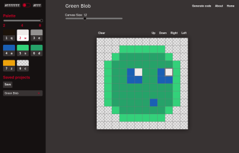
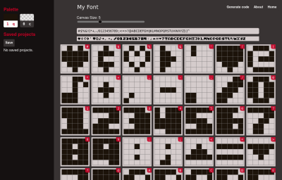

# Mini pixelart editor

## A mini editor for sprites and fonts

The goal of this tool started as a way for me to create pixel art with a restricted palette and convert it to a string format that I could use in my JS13K games.

The original inspiration for this project came from a similar tool made by @xem called [miniPixelArt](https://xem.github.io/miniPixelArt/). I wanted to extend its capabilities and make it more usable, as well as make it export more readable code.

I started on 2023 with the basic functionality. One year later I had to adapt the editor for my new game, which required an even smaller color palette than the original 8 colors, as I was creating a black and white game. The editor and the generated code thus became more flexible.

After the 2024 competition, I realized I could use a similar editor to simplify editing my custom font, and so the mini font editor was born.

[Try it out](https://lopis.github.io/mini-pixelart-editor/)

## Ideas for improvement

- Allow imported a string into the editor
- Allow multi-colored fonts

## Development

This project is written in plain HTML/JS/CSS and has no build steps, because I was lazy. I had honestly outgrew its modest original seams, so the code is sort of a mess.

If you have python installed, you can run `yarn dev` to start an HTTP server in port 3000. Otherwise, simple open the `index.html` file directly in your browser.
